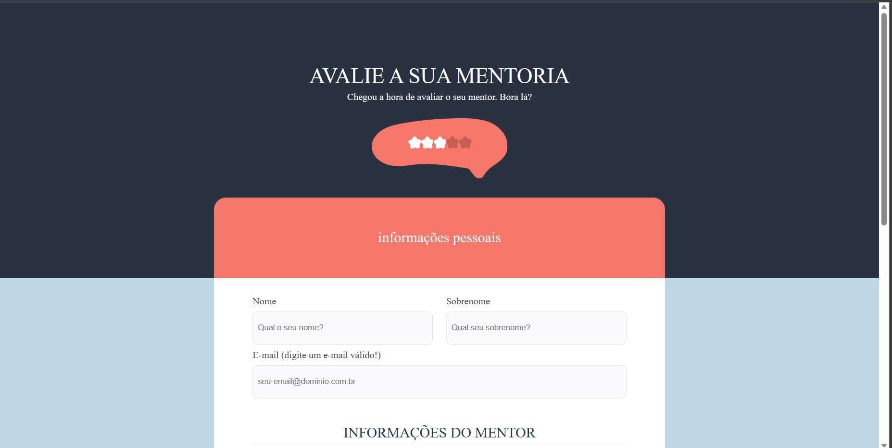

<h1 align="center">EXP - Stage-3 | Mentoria - Avaliação</h1>

Questionário de avaliação de mentoria com possibilidade de agendamento da próxima mentoria.

  <a href="#-tecnologias">Tecnologias</a>&nbsp;&nbsp;&nbsp;|&nbsp;&nbsp;&nbsp;
  <a href="#-projeto">Projeto</a>&nbsp;&nbsp;&nbsp;|&nbsp;&nbsp;&nbsp;
  <a href="#-layout">Layout</a>&nbsp;&nbsp;&nbsp;|&nbsp;&nbsp;&nbsp;
  <a href="#memo-licença">Licença</a>

  

 

  

## 🚀 Tecnologias

Esse projeto foi desenvolvido com as seguintes tecnologias:

- HTML e CSS
- Git e Github
- Figma
- Markdown

## 💻 Projeto

A página "Mentoria - avaliação" é um formulário de avaliação com possibilidade de agendamento para umapróxima seção de mentoria.

🔗 - [Visite o projeto](https://renancassiano-br.github.io/exp-p3-from-mentoria-avaliacao/)

## 🔖 Layout

Você pode visualizar o layout do projeto através [DESSE LINK](https://www.figma.com/file/fnZyJHs7eqNFAA7tUrKcsD/Stage-03---Formul%C3%A1rio-avan%C3%A7ado/duplicate). É necessário ter conta no [Figma](https://figma.com) para acessá-lo.

## :memo: Licença

Esse projeto está sob a [licença MIT](https://github.com/remy/mit-license).

---

Feito com ♥ by Rocketseat :wave: [Participe da nossa comunidade!](https://discord.gg/rocketseat)
